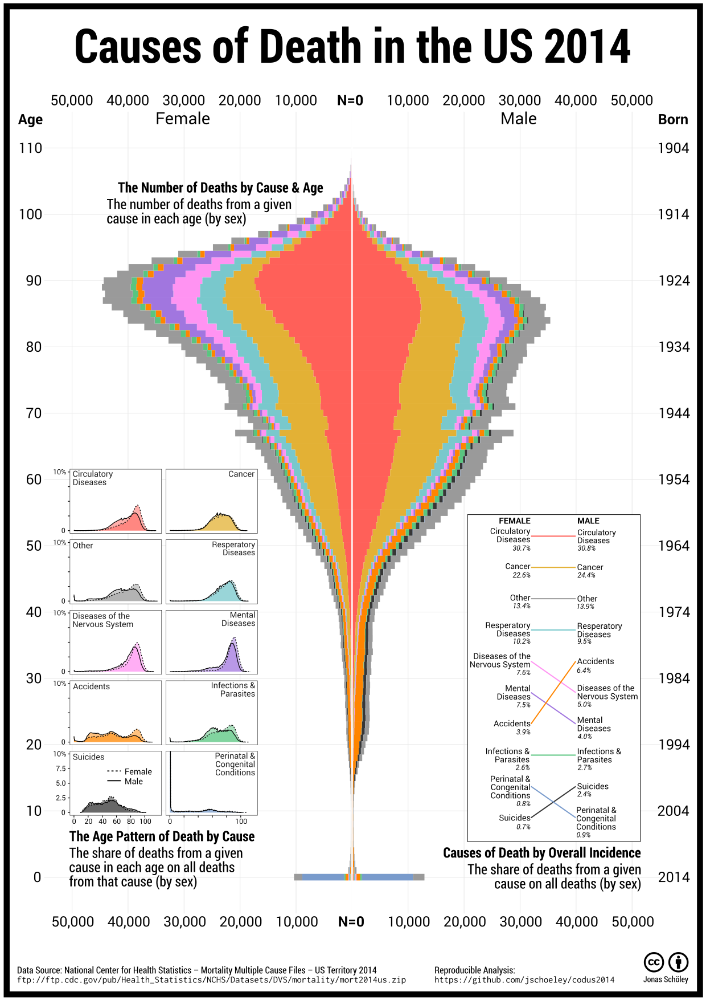
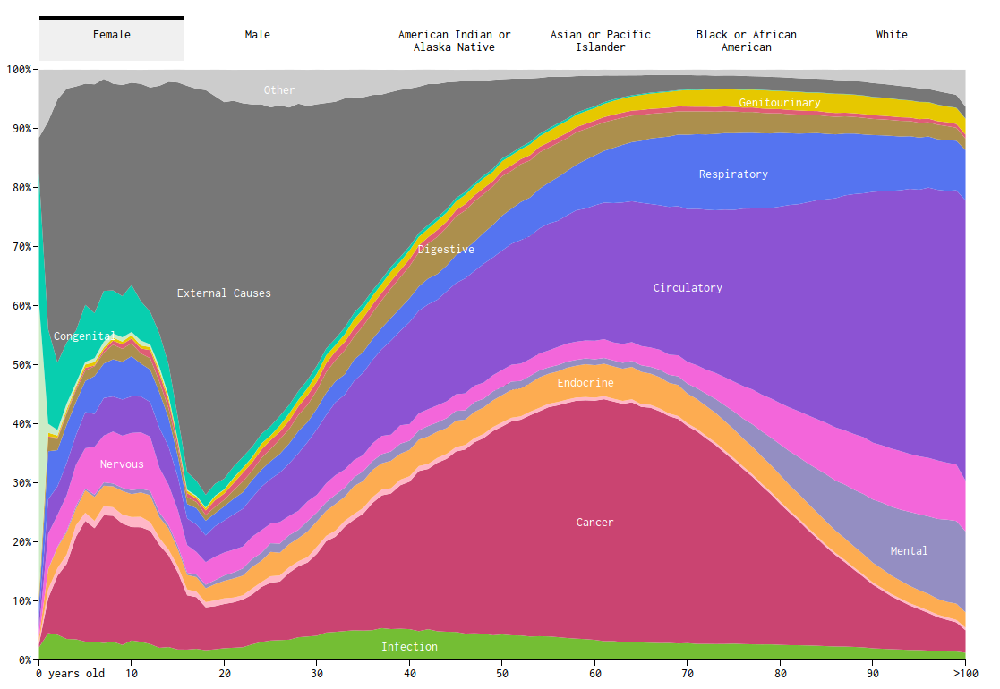

*My Reply to flowingdata's Causes of Death Chart*

Complementing [flowingdata's causes of death chart](http://flowingdata.com/2016/01/05/causes-of-death/) I visualize US deaths by cause. I focus on *raw counts and the age distribution of deaths* answering questions like:

- Do more people die due to cancer than due to circulatory diseases? (no)
- At what age do the most suicide deaths occur? (49 for males, 50 for females)
- Do more adolescents die by accident than people aged 60+? (no)

*Causes of Death by Overall Incidence*: Circulatory diseases are the most common cause of death in the US 2014 accounting for nearly a third of all observed deaths. Cancer is second with 22.6 % of all female deaths and 24.4 % of all male deaths. Suicides and accidents are more common with males while females die more often from mental diseases and diseases of the nervous system.

*The Number of Deaths by Cause and Age*: Deaths are concentrated in old age. 9 out of 10 deaths in the US 2014 happen beyond age 50; half of all deaths in ages 77 and older. The age with the highest count of deaths is 89 for females and 84 for males. While extremely few deaths happen during childhood, death counts spike in infancy. Most of the infant deaths are due to perinatal and congenital conditions. Deaths in adolescence and early adulthood are rare and predominantly the result of external causes, with accidents being more numerous than suicides. We see substantially more adolescent and early deaths in males than in females. This is due to higher numbers of fatal accidents and suicides in males. Starting around ages 45--50 the relative majority of deaths are due to cancer. Circulatory diseases become the leading cause of death during ages 75--80 while cancer gradually declines in importance. Mental diseases and diseases of the nervous system are common causes of death at ages 80+.

*The Age Pattern of Deaths by Cause*: While we learned that death in an adolescent age is most likely the result of an accident or suicide, fatal accidents are just as often observed in old age and most suicides are actually observed around ages 50--60. Perinatal & congenital conditions, if fatal, result almost exclusively in death during the first year of life. Circulatory diseases, cancer, respiratory diseases, diseases of the nervous system, mental diseases, infections & parasites are causes of death that are predominantly observed during advanced ages.

Motivation
----------

Earlier this year *Nathan Yau* of [flowingdata](http://flowingdata.com/) published an interactive visualization showing the distribution of different [causes of death](http://flowingdata.com/2016/01/05/causes-of-death/) along the age axis.

*Causes of Death by Nathan Yau posted on flowingdata.com*

Nathan Yau plotted shares *conditioned on age*: For those who died at age x, what share of them died of a given cause? This is a reasonable choice and makes for an informative chart **but** one has to keep in mind that more people die in old age than in young ages. Omitting this information can lead to misinterpretations. As an example: External causes (Suicide, Accident) are visually *very* prominent in the flowingdata plot whereas they only add up to 5 % of *all* Female deaths registered in the US 2005 to 2014. Likewise cancer seems to be a just as common cause of death as circulatory diseases whereas actually the latter is the leading cause of death among females and males.

Some of the Twitter audience wished for a version of flowingdata's chart using absolute numbers or shares that do not add up to 100 % for each age. This is where my chart comes in *complementing*, not replacing, Nathan Yau's visualization.

Pitfalls
--------

Showing raw counts or the age-distribution of deaths due to a given cause introduces biases of its own. We must be careful not to interpret the number or share of deaths in some age as a measure for the mortality in that age. As an example: The baby boomers now and in the future will contribute a lot of deaths to the overall cause of death distribution. This is not because they are especially frail but because they are especially numerous. So while the distribution of deaths over age is definitely shaped by varying age-specific mortality, it is also shaped by varying population sizes by age and we can't tell the one from the other by just looking at counts of deaths.

Technical Background
--------------------

The *Causes of Death in the US 2014* chart has been created using open data and open software.

- Data: [National Center for Health Statistics -- Mortality Multiple Cause File US 2014](ftp://ftp.cdc.gov/pub/Health_Statistics/NCHS/Datasets/DVS/mortality/mort2014us.zip)
- Analysis: reproducible `R` code is available on [github](https://github.com/jschoeley/codus2014); all plots have been created using the [`ggplot2`](http://docs.ggplot2.org/current/) library; my thanks to the [Hadleyverse](http://adolfoalvarez.cl/the-hitchhikers-guide-to-the-hadleyverse/)
- Poster Layout: [Inkscape](https://inkscape.org/en/)

cc-by Jonas Schöley